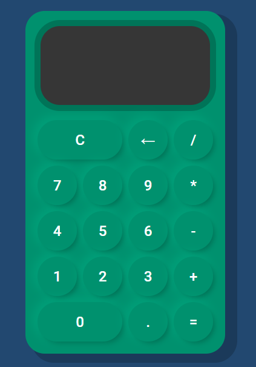

# Caluladora 🖩

👨‍💻 Calculadora responsiva hecha con las siguententes tecnologías:

- Javascript
- Css
- HTML

---

Utiliza la fuente [Roboto](https://fonts.google.com/specimen/Roboto?query=roboto), que pueden ver haciendo click en el enlace.

En javascript, hace uso de los siguentes recursos:

- Clases
- Constructores 
- Template stings
- Operadores lógicos

 